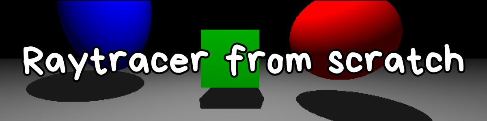

    

Implementation of the core ray tracing algorithms, featuring multiple geometric shapes, Lambertian shading, shadows, object transformations, and interactive camera controls.

 

> **Academic Project**
>
> This project was developed as part of a university Computer Graphics assignment. The implementation follows the concepts presented in *Fundamentals of Computer Graphics* by Peter Shirley while being written from scratch in C++ using openFrameworks.

---

# 🖼️ Render with perspective rays

    

---

# 📖 Overview:

This project implements a simple CPU ray tracer capable of rendering multiple geometric primitives with Lambertian illumination and shadow rays.

For each pixel on the screen, a ray is generated from a virtual camera and tested against every object in the scene. The closest intersection is colored and shaded using diffuse lighting while additional shadow rays determine whether each point is illuminated or occluded.

The primary goal of this project was to better understand the mathematics and algorithms behind ray tracing rather than developing a production renderer.

---

# ✨ Features and Technical Highlights:

- ✅ Perspective and Parrallel camera rays
- ✅ Sphere intersection
- ✅ Ellipsoid intersection
- ✅ Plane intersection
- ✅ Cube intersection
- ✅ Lambertian diffuse shading
- ✅ Shadow rays
- ✅ Object translation
- ✅ Object rotation
- ✅ Object scaling
- ✅ Mouse object picking
- ✅ Camera pan
- ✅ Camera orbit
- ✅ Automatic re-rendering after changes in scene
- ✅ Render time measurement
- ✅ Self-build math library --> 3DMath
- ✅ Objects with local coordinates

---

# 🖼️ Render with parallel rays

    

---

# 🧠 How It Works:

For every pixel, the renderer generates a ray from the active camera and checks whether it intersects with any object in the scene; if the ray strikes an object, that object in that pixel is colored on the screen.

Each object stores both its transformation matrix and its inverse. Rather than transforming the geometry itself, the incoming ray is transformed into the object's local coordinate system before performing the intersection test. This allows each primitive to keep a simple analytical intersection equation while supporting arbitrary translation, rotation, and scaling.

After finding the closest intersection, the renderer casts a shadow ray toward the point light source. If no object blocks the light, Lambertian diffuse illumination is computed using the surface normal and light direction.

---

# 🕹️ Controls:

## Camera

| Key | Action |
|------|--------|
| `p` | Toggle Perspective / Orthographic view |
| `w a s d` | Pan camera on x and y axis |
| `q e` | Pan camera on z axis |
| `i k` | Orbit vertically |
| `j l` | Orbit horizontally |
| `Shift + r` | Reset camera |

---

## Object Selection & Transformation

*(Select an object first with the mouse.)*

| Key | Action |
|------|--------|
| Mouse Click | Select object |
| Arrow Keys  | Translate object on x and y axis |
| `f b` | Translate object on z axis |
| `n` / `m` | Scale Up / Down |
| `x` `y` `z` | Rotate around X / Y / Z axis|
| `Shift + x / y / z` | Rotate in opposite direction|
| `r` | Reset selected object |

---

# 📚 What I learned:

Through this project, I learned how a ray tracer works, from generating rays and detecting intersections to displaying 3D objects on the screen. I also gained more experience working with vectors, transformation matrices, and the mathematics behind 3D graphics.

I explored how shapes such as cubes, spheres, planes, and ellipsoids can be represented and how to calculate their intersection points with rays. The project also helped me review and improve my object-oriented programming skills by organizing the different shapes and parts of the ray tracer into individual classes.

---

# ⚠️ Notes & Limitations:

- Rendering is performed entirely on the CPU.
- No GPU acceleration or shaders are used.
- Single point light source.
- No reflections or refractions.
- No anti-aliasing.
- Intended as an educational implementation focused on understanding ray tracing fundamentals.

---

**Made with C++ ❤️ and openFrameworks**

